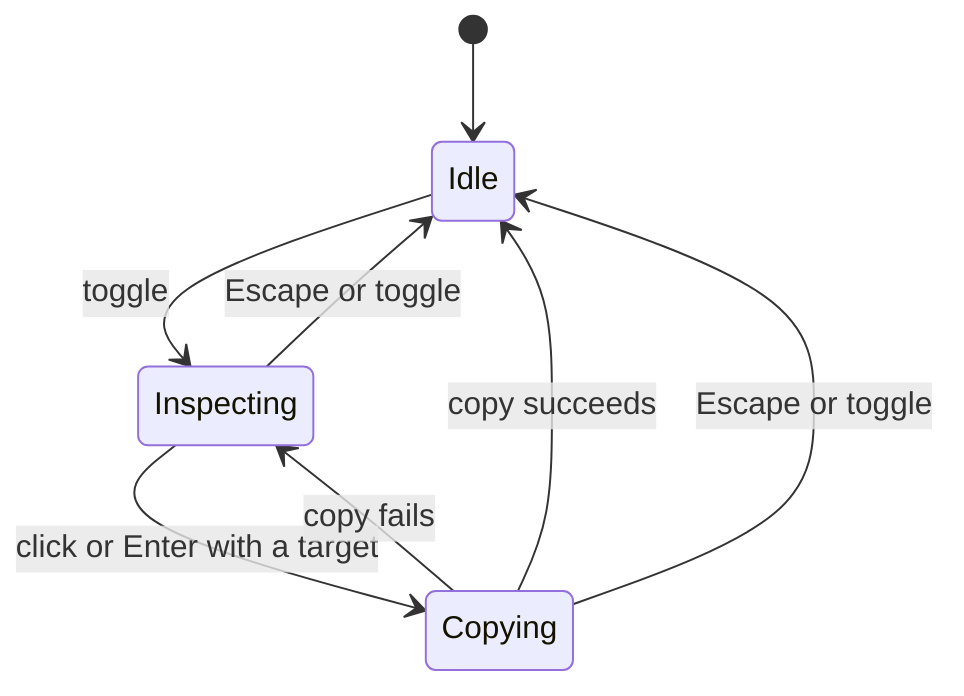

# 00 - Steal

Status: implemented
Last updated: 2026-09-05

Steal is a local, unpacked Chrome extension for selecting an element and copying
its page HTML without Steal-owned additions.

## Problem Statement

When I am looking at a web page and want the HTML for one specific element, the
Chrome DevTools workflow is heavier than the task deserves. I have to open
DevTools, use the element picker, find the node in the Elements panel, right-click
it, and choose Copy > Copy element. I want a one-key way to point at an element on
the page and get its HTML onto my clipboard.

The name is a joke. The extension only ever writes to the clipboard; it sends
nothing anywhere.

## Solution

A small Chrome extension. Click its toolbar icon to turn on "inspect mode" for
the current tab. As the mouse moves, the element under the cursor is highlighted
with a translucent overlay and a label naming it. The current selection can also
be nudged around the DOM tree with the arrow keys without moving the mouse.
Clicking the element, or pressing Enter, copies its page HTML to the
clipboard, a small toast confirms what was copied, and inspect mode turns itself
off.

## User Stories

1. As a user, I want to toggle inspect mode from the extension's toolbar icon or a keyboard shortcut, so that I do not need to open DevTools or reach for the mouse.
2. As a user, I want the toolbar icon to show an `ON` badge while inspect mode is active, so that I can tell at a glance whether it is running.
3. As a user, I want clicking the toolbar icon again to turn inspect mode off, so that I can cancel without selecting anything.
4. As a user, I want inspect mode to apply only to the tab I activated it on, so that other tabs are unaffected.
5. As a user, I want the element under my cursor to be highlighted with a translucent overlay matching its bounding box, so that I can see exactly what will be copied.
6. As a user, I want a floating label showing the element's tag name, id, classes, and pixel dimensions, so that I can confirm I have the right element.
7. As a user, I want the highlight overlay to not intercept my mouse, so that moving the cursor still reflects the true element underneath.
8. As a user, I want only one element selected at any time, so that the interaction stays simple.
9. As a user, I want to press the Up arrow to move the selection to the previous element sibling, or to the parent when there is no previous sibling, so that Up always steps somewhere sensible.
10. As a user, I want to press the Down arrow to move the selection to the next element sibling, or, when the current element has none, to the nearest following element of an ancestor, so that a lone child still steps forward instead of dead-ending.
11. As a user, I want to press the Left arrow to move the selection to the parent element, so that I can widen the selection to a container.
12. As a user, I want to press the Right arrow to move the selection to the first element child, so that I can narrow into a container.
13. As a user, I want arrow traversal to land only on element nodes, skipping text and comment nodes, so that the selection is always something copyable.
14. As a user, I want arrow traversal to skip document-metadata elements (`head`, `meta`, `title`, `script`, `link`, `style`, `base`, `noscript`) and the extension's own overlay, so that pressing Right on `html` lands on `body` and I never end up inside `head`.
15. As a user, I want arrow presses at the edges of the tree to do nothing (no wrap-around), so that I do not lose my place unexpectedly.
16. As a user, I want the selected element scrolled into view when arrow navigation lands on something offscreen, aligned to whichever edge it went past with a small margin, so that the page keeps its natural scroll direction and the highlight stays visible.
17. As a user, I want the arrow keys and Space to not scroll the page while inspect mode is active, so that navigation and scrolling do not fight each other.
18. As a user, I want moving the mouse again to immediately re-select the element under the cursor and discard any keyboard traversal state, so that the mouse is always authoritative when I use it.
19. As a user, I want to click the highlighted element to copy it, so that the interaction matches how I already point at things.
20. As a user, I want to press Enter to copy the current selection, so that I can finish a keyboard-only traversal without reaching for the mouse.
21. As a user, I want my click fully suppressed on the page (no link navigation, no button activation), so that inspecting never triggers the page's own behavior.
22. As a user, I want the selected element's page HTML copied without Steal's own additions or formatting changes, so that I get the page content I selected.
23. As a user, I want a small toast at my cursor position confirming the copy and naming what was copied, so that I have immediate feedback.
24. As a user, I want the toast to fade away on its own after about a second, so that it does not get in my way.
25. As a user, I want inspect mode to turn itself off after a successful copy, so that the page returns to normal without another step.
26. As a user, I want Esc to end inspect mode and remove its overlay immediately, so that I can cancel selection or stop waiting for a pending copy without affecting a later inspection.
27. As a user, I want the extension's own overlay, label, and toast to never be selectable or copyable, so that I only ever get real page content.
28. As a user, I want the extension to ask for as few permissions as possible, so that I am comfortable running it.
29. As a user, I want to load the extension into Chrome myself as an unpacked extension, so that I can use it without publishing it anywhere.
30. As a user, I want clear instructions for loading and reloading the extension, so that I can install it and pick up changes.

## Architecture

Steal ships plain JavaScript, HTML, and CSS as a Chrome Manifest V3 extension.
There is no bundler, TypeScript, build step, or runtime dependency. It operates
in the top document of the activated tab.

| File | Responsibility |
| --- | --- |
| `manifest.json` | Toolbar action, shortcut, permissions, and icon paths. |
| `background.js` | Activation, script injection, and per-tab badge updates. |
| `content.js` | Inspect lifecycle, input handling, selection, feedback, and clipboard writes. |
| `lib/dom-nav.js` | Side-effect-free traversal and element descriptions. |
| `lib/page-content.js` | Ownership of injected nodes and temporary page changes; page HTML capture. |
| `content.css` | Overlay, label, toast, and inspect cursor styles. |
| `tools/gen-icons.py` | Generates the 16, 48, and 128 px icons using Python's standard library. |

The content controller exposes only `toggle()`. Start, stop, selection, and
pending-copy state are private to its closure. The page-content module hides
ownership and restoration details from the controller; the navigation module
hides traversal and skip rules.

## Activation and lifecycle

### Activation and messages

The manifest requests only `activeTab` and `scripting`, with no host permissions
or declared content scripts. The toolbar action and `toggle-steal` keyboard
command both call `toggleOnTab(tab)` in `background.js`. The default shortcut is
`Ctrl+Shift+S`, or `Command+Shift+S` on macOS, rebindable at
`chrome://extensions/shortcuts`.

Activation inserts `content.css`, executes `lib/dom-nav.js`,
`lib/page-content.js`, and `content.js` in that order, then sends
`inspect:toggle`. The content script registers one message listener and stores
the controller on `window.__inspectCopyController` to guard against repeated
initialization. The listener calls `toggle()`; callers do not manipulate the
controller's state directly. An injection failure is logged by the background
script and does not activate inspect mode.

The controller sends `inspect:started` and `inspect:ended` messages. The
background script uses them to track active tab IDs and set or clear the blue
`ON` badge for each tab. It clears tracked state when a tab starts loading or
closes. Inspect mode is not restored across navigation.

### States and transitions

The three logical states are represented by a nullable session and its
`copying` flag, rather than separate state objects or classes.

- **Idle:** no current inspection or input listeners. A previous success toast
  may still be fading.
- **Inspecting:** one inspection owns the current target, UI, and input
  listeners. It can accept a copy request when a target exists.
- **Copying:** that inspection has one pending write. Further click/Enter
  requests are suppressed. Pointer and arrow navigation remain available, but
  the pending write retains the HTML captured when it began.

Every copy completion belongs to the inspection that started it. Ending an
inspection invalidates that identity before cleanup. An expired completion
cannot show feedback, end a new inspection, or begin a fallback write. A write
already submitted to the clipboard cannot be undone.

Starting an inspection builds its UI, attaches capture-phase listeners, applies
the inspect cursor class, and seeds selection from the last recorded pointer
coordinates (initially `0,0`). Exiting removes the listeners, restores recorded
page changes, clears the target, and reports `inspect:ended` immediately. On
success, the overlay and label are hidden while the toast fades, and the root
is removed after about 1.6 seconds. Escape and toggle-off remove the current
inspection's root immediately.

## Selection and feedback

### Target and navigation

There is one current target. Mouse movement selects
`document.elementFromPoint(clientX, clientY)`, replacing any arrow-key selection.
Steal-owned nodes cannot become the target.

`nextTarget(node, direction, skip)` in `lib/dom-nav.js` determines arrow moves:

| Key | Destination |
| --- | --- |
| Up | Previous element sibling, or the parent if no eligible sibling exists. |
| Down | Next element sibling, or the first following sibling found while walking up the ancestors. |
| Left | Parent element, stopping at `<html>`. |
| Right | First eligible element child. |

Traversal skips non-elements, Steal-owned nodes, and `head`, `meta`, `title`,
`script`, `link`, `style`, `base`, and `noscript`. The controller supplies the
ownership check alongside the navigation module's `isSkippable` predicate.
There is no wrap-around; a move with no eligible destination leaves selection
unchanged. Right from `<html>` lands on `<body>`.

Arrow keys and Space prevent the page's default scrolling while inspecting.
Space has no other action. Mouse down, mouse up, and click are intercepted in
the capture phase and call `preventDefault`, `stopPropagation`, and
`stopImmediatePropagation`; click requests the copy.

### Scrolling and highlight

An arrow-selected target is scrolled into view when it falls outside the
viewport's 96 px top/bottom inset or crosses a horizontal edge. The controller
uses `scrollIntoView` so scrollable ancestors participate. A target below the
inset is bottom-aligned; one above it is top-aligned. A target taller than the
available height is top-aligned. Horizontal alignment is `nearest`.

The page-content module applies temporary top/bottom scroll margins and
restores them on the next animation frame or immediately on exit. Repeated
navigation restores a previous temporary change before recording another.
Deferred restoration only applies to the change that scheduled it.

Each inspection has a marked root appended to `document.body`, or to
`documentElement` if there is no body. It holds the fixed-position blue overlay,
label, and toasts. Its styles use a high z-index, scoped selectors, explicit
values, and an `all: initial` reset. The root and visual elements use
`pointer-events: none`.

The overlay follows `target.getBoundingClientRect()` on selection changes,
scroll, resize, and the frame after keyboard scrolling. The label shows
`tag#id.class1.class2` and rounded pixel dimensions. It sits above the target,
or below it when there is insufficient room above.

## Page HTML and clipboard

### Page-content ownership

`lib/page-content.js` records the actual roots it mounts and the temporary
class/style changes it applies. Ownership follows node identity, not matching
IDs, classes, or data attributes. Page-owned lookalikes remain selectable and
copyable. A pre-existing `ic-active` class remains page-owned.

To capture HTML, the module clones the selected subtree, removes recorded
Steal roots from the detached copy, restores recorded temporary changes on
that copy, and reads its `outerHTML`. Capture does not remove or rewrite nodes
in the live page. This excludes the current overlay and any lingering success
toast, including when the target is `<body>` or `<html>`. There is no
pretty-printing or other intentional content transformation.

The same restoration rules apply to capture and live cleanup. When an
attribute still matches the value Steal applied, its original text is restored
exactly, including whether the attribute existed. If the page has edited it,
only still-owned class tokens or style properties are restored; the page's
other edits and property priorities are preserved. A page rewrite to exactly
the same token/value is indistinguishable from Steal's own value.

### Clipboard write and result

Click or Enter captures the target's description and page HTML before beginning
the write. The controller first attempts `navigator.clipboard.writeText` from
the input handler. If it is unavailable or fails, and the originating
inspection is still current, it tries an off-screen readonly textarea with
`document.execCommand('copy')`. The textarea is removed in `finally`, including
when copying throws.

A successful write shows `✓ Copied ` followed by the captured description and
ends the inspection. If both mechanisms fail, an error toast reads
`✕ Copy failed`, the pending flag clears, and inspection continues so the user
can retry.

Toasts appear at the click coordinates or near the selected target for Enter,
with their anchor clamped into the viewport. They fade in, remain for about
1.2 seconds, and are removed after fading out. Toasts cannot become targets
and are excluded from later HTML captures.

## Testing

`npm test` uses Node's built-in test runner. Tests assert observable behavior
through the same input and output paths used by the extension.

- `test/dom-nav.test.js` checks traversal, skipped nodes, edge behavior, and
  descriptions using dependency-free fake element trees.
- `test/content.test.js` loads the shipped scripts into jsdom and drives toggle
  messages, keys, and pointer events. It controls clipboard completion and
  animation frames to check stale results, duplicate input, fallback cleanup
  and retry, copied HTML, and page-change restoration. jsdom is a development
  dependency; the installed extension does not load it.
- The unpacked extension and `demo.html` provide the browser check for real
  clipboard permissions, user gestures, click suppression, scrolling, and
  visual placement. Simulated browser effects do not establish those platform
  guarantees.

## Local installation and development

1. Open `chrome://extensions` and enable Developer mode.
2. Choose **Load unpacked** and select `personal-projects/steal/`.
3. Pin the toolbar icon.

After editing source files, reload the extension and the target page. The
initialization guard retains an existing controller in an already-open
page; reinjection does not hot-update it. Keep the extension folder in place
while it is installed. There is no server or published deployment.

Run `npm install` for the development test dependency, `npm test` for the test
suite, and `npm run gen-icons` to regenerate the icons. The source files are
the shipped files.

## Out of scope

- Iframes and cross-origin frames; inspection uses the top document only.
- Pretty-printing, selectors, XPath, computed styles, and screenshots.
- Firefox, Safari, and other non-Chromium browsers.
- Settings, selection history, and multi-element selection.
- Persisting inspection or selection across navigation.
- Store publication and packaged distribution.
