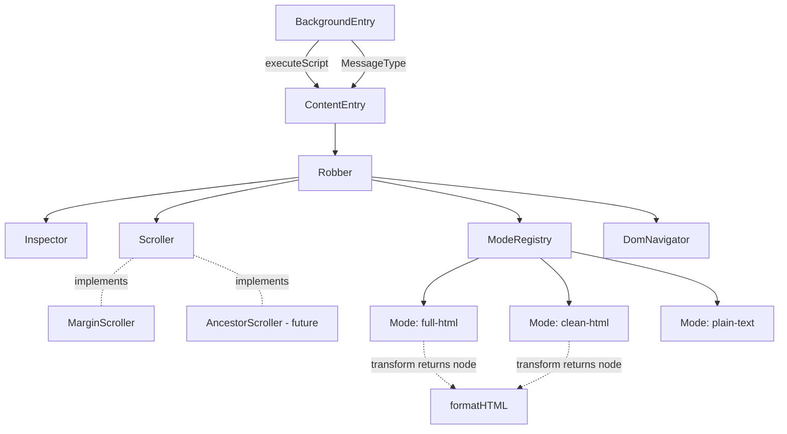

# 02 - TypeScript Rewrite

Status: implemented
Last updated: 2026-09-05

Builds on [00-steal.md](./00-steal.md) and [01-multi-format-copy.md](./01-multi-format-copy.md).
This spec is structural only — build tooling, module boundaries, and
terminology. No behavior change: every user story in 00 and 01 continues to
hold exactly as written. `README.md` and `.specs/00`/`.specs/01` are
deliberately **not** updated by this spec; they stay as historical snapshots
until a later pass consolidates 00, 01, and this spec into one cohesive
current-state document.

## Problem Statement

As the sole maintainer of Steal, plain JavaScript with hand-rolled UMD-style
module wrappers (`(typeof module === "object" && module.exports) ? ... :
(typeof self !== "undefined" ? self : this, function (deps) {...})`) has
become the wrong tradeoff. Every `lib/` file spends its first and last few
lines on module-loading mechanics instead of the logic it exists to hold, none
of it is type-checked, and the "format" naming for the copy-mode feature
collides with the unrelated, more literal meaning of "format" as in
"pretty-print this HTML" — one word doing two jobs makes both harder to talk
about. Comments are also `//`-block prose, which reads as dense paragraphs
instead of something skimmable. The current `lib/page-content.js` module also
bundles three genuinely independent responsibilities (owned-node tracking, an
"inspecting" class toggle, and scroll-margin patching) behind one object,
purely because one caller happened to need all three undone together.

## Solution

Migrate the extension to TypeScript, built by Vite into a self-contained
`dist/` folder that Chrome loads directly (unpacked, same manual-reload
workflow as today). Split every source file into either a thin `entries/`
script that talks to `chrome.*` APIs, or a `lib/` module that holds pure,
independently testable logic with zero knowledge of the extension runtime.
Rename the copy-mode concept from "format" to "mode" throughout the codebase,
freeing "format" to mean what it should: turning a DOM node into indented
HTML. Convert `//`-block comments to Markdown-formatted `/** */` doc comments.
Split `lib/page-content.js` into an orchestrator (`Robber`) and two
independent, sibling collaborators (`Inspector` for the page's DOM footprint,
`Scroller` for scroll-into-view behavior) that don't know about each other.

## User Stories

1. As the maintainer, I want the project to compile with TypeScript in `strict` mode, so that DOM-heavy code (nullable `querySelector` results, event types, `chrome.*` typings) is checked instead of trusted.
2. As the maintainer, I want one `npm run build` producing a self-contained `dist/` folder, so that "Load unpacked" in `chrome://extensions` points at one place and always reflects the latest build.
3. As the maintainer, I want a `npm run dev` watch mode, so that I can edit source and only need to click "reload" on the extension card and refresh the test page, without changing my existing manual-reload habit.
4. As the maintainer, I want `npm test` to run on Vitest against the TypeScript sources directly, so that tests don't require a separate compile step or a different toolchain than the build.
5. As the maintainer, I want every file that touches `chrome.*` APIs isolated inside `src/entries/`, so that the logic in `src/lib/` never needs a mocked `chrome` global to be tested.
6. As the maintainer, I want the inspection state machine (session, target, overlay, keyboard traversal, copy lifecycle) extracted into its own testable class, so that its correctness doesn't depend on being injected into a real page via `chrome.scripting`.
7. As the maintainer, I want the extension's DOM-footprint tracking (injected UI nodes, the temporary "inspecting" class, clean capture) and the scrolling-into-view behavior to be two fully independent collaborators with no reference to each other, so that changing how one works can never silently break the other.
8. As the maintainer, I want the "scroll a target into view with breathing room" logic behind a swappable interface, so that trying a different scrolling approach later is a one-line change, not a rewrite.
9. As the maintainer, I want the three cross-file `chrome.runtime` message strings (`"inspect:toggle"`, `"inspect:started"`, `"inspect:ended"`) replaced with a single typed source of truth, so that a typo in one file is a compile error instead of a silent runtime mismatch.
10. As the maintainer, I want "format" renamed to "mode" everywhere it currently means "Full HTML / Clean HTML / Plain Text" (identifiers, the `chrome.storage.local` key, directory and file names, UI-facing text), so that the word "format" is free to mean HTML pretty-printing instead.
11. As the maintainer, I want the pretty-printing function (today's `serialize()`) renamed to `formatHTML()` and treated as a small pure utility, so that its name matches what it does.
12. As the maintainer, I want comments rewritten as `/** */` blocks using Markdown structure (short lead sentence, then a list or brief example when there are genuinely multiple points), so that non-obvious rationale is skimmable instead of a wall of `//` paragraphs.
13. As the maintainer, I want this rewrite to change no observable behavior, so that every existing test assertion and every user story in 00/01 still describes the shipped extension exactly. This includes the current (easy to miss) behavior where exiting inspection eagerly reverts any still-pending scroll-margin patch instead of waiting for its animation frame.

## Low-Level Design

### Requirements

```text
Requirements:
1. TypeScript is the primary implementation language; Vite (esbuild) builds
   dev and production bundles into a self-contained dist/.
2. Runtime wiring (chrome.* glue) is separated from pure logic — no UMD/IIFE
   module-detection boilerplate anywhere in src/.
3. "format" -> "mode" everywhere in code (copy mode: Full HTML / Clean HTML /
   Plain Text). "format" is reclaimed for HTML pretty-printing.
4. Cross-file message-type strings become a typed const object, not raw
   string literals.
5. Comments switch from `//`-block prose to skimmable `/** */` Markdown.
6. The "scroll target into view" behavior sits behind a swappable interface,
   and is a full sibling of DOM-footprint tracking, not owned by it.

Out of Scope:
- Any behavior change — every user story in 00/01 must still hold.
- README.md and .specs/00/01 rewrites (deferred to a later consolidation pass).
- HMR / auto-reload dev workflow (manual reload is fine).
- Implementing a second scroller (interface only, one implementation ships).
- Populating lib/utils/ beyond what this rewrite concretely needs.
```

### Entities and Relationships

```text
Entities:
- BackgroundEntry (src/entries/background.ts) — tab/badge orchestrator
- ContentEntry    (src/entries/content.ts)    — chrome.storage/runtime boundary
- Robber          (src/lib/robber.ts)         — the orchestrator: session,
                                                 target, UI, mode, event
                                                 registration
- Inspector       (src/lib/inspector.ts)      — extension-node registry,
                                                 overlay injection, clean
                                                 capture — no scroll awareness
- Scroller        (interface, src/lib/scroll/scroller.ts) — how to bring a
                                                 target into view — no DOM-
                                                 footprint awareness
- MarginScroller  (src/lib/scroll/margin-scroller.ts) — implemented now
- AncestorScroller — sketched only, not built this pass
- ModeRegistry / Mode (src/lib/modes/) — Full HTML / Clean HTML / Plain Text
- DomNavigator    (src/lib/dom-navigator.ts) — pure traversal math
- formatHTML      (src/lib/utils/format-html.ts) — pure DOM-node -> indented string
- MessageType     (src/lib/messages.ts) — const-object protocol

Relationships:
- BackgroundEntry -> chrome.scripting (injects the built content bundle)
- BackgroundEntry -> MessageType (interprets inspect:started/ended)
- ContentEntry -> Robber (constructs + owns one instance)
- ContentEntry -> MessageType (sends inspect:started/ended, receives inspect:toggle)
- Robber -> Inspector (has-a, sibling of Scroller)
- Robber -> Scroller (has-a, sibling of Inspector)
- Robber -> ModeRegistry (reads active Mode)
- Robber -> DomNavigator (arrow-key traversal, using Inspector.isExtensionNode
  as the skip predicate)
- MarginScroller, AncestorScroller -> Scroller (implements)
- Mode.transform() -> formatHTML (only when transform returns a DOM node)
```

`Inspector` and `Scroller` never reference each other. `Robber` is the only
entity that holds both, and is therefore the only place that ever needs to
know both exist.



Nothing in `Inspector`, `Scroller`, or `MarginScroller` imports `chrome`. The
two `entries/` files are the only place `chrome.*` is referenced at all.

### Class Design

**`Robber`** — the orchestrator. Registers the pointer/keyboard listeners,
owns which mode is active, and sequences `Inspector` and `Scroller` — the only
entity that ever calls into both.

| State | Behavior |
|---|---|
| `session: {copying, mode} \| null` | `toggle()` |
| `target: Element \| null` | `start()` / `stop()` (private) |
| `ui: {root, overlay, label} \| null` | `handlePointerMove(x, y)` |
| `lengthCache` | `handleKey(e)` |
| `inspector: Inspector` (injected) | `scrollTargetIntoView()` — calls `scroller.scrollIntoView(...)` directly |
| `scroller: Scroller` (injected) | `copy()` |

```text
start()
  inspector.mount(uiRoot)
  inspector.setInspecting(true)
  attach pointer/keyboard listeners

stop()
  inspector.setInspecting(false)
  scroller.flush()          // no scroll residue left behind on exit
  detach listeners

copy()
  scroller.flush()          // guarantee no pending scroll patch before cloning
  copy = inspector.capture(target)
  output = mode.transform(copy)
  html = output is a node ? formatHTML(output) : output
  navigator.clipboard.writeText(html)
```

**`Inspector`** — the DOM-facing interface for everything Steal itself adds
to or changes on the page. No knowledge of scrolling at all:

| State | Behavior |
|---|---|
| `roots: WeakSet<Node>` | `mount(root: Node): void` |
| `inspectClass: {el, original, applied} \| null` | `isExtensionNode(el: Element): boolean` |
| | `setInspecting(on: boolean): void` |
| | `capture(el: Element): Element` |

```text
capture(el)
  copy = el.cloneNode(true)
  zip(walk(el), walk(copy)).forEach(([original, clone]) => {
    if (roots.has(original)) clone.remove()
    if (original === inspectClass?.el) restoreClass(clone)
  })
  return copy
```

`isExtensionNode` (renamed from an earlier `isOwnNode` naming pass) answers
"did Steal itself put this node here?" — used by `Robber` as the traversal
skip-predicate (so arrow keys never land on Steal's own overlay) and as a
guard before setting the pointer target (so a click never copies Steal's own
UI). Both are existing requirements from `00-steal.md`, not new behavior.

**`Scroller`** (interface) — the swap point for "how do we bring a target
into view," fully independent of `Inspector`:

```typescript
interface ScrollAlignment { block: "start" | "end"; inline: "nearest"; margin: number }

interface Scroller {
  scrollIntoView(el: Element, alignment: ScrollAlignment): void;
  flush(): void;   // synchronously settle any pending scroll patch right now
}
```

`flush()` replaces an earlier `restoreInto(original, clone)` design that would
have required `Inspector` to call into `Scroller` per node during `capture()`.
Instead, `Robber` calls `scroller.flush()` immediately before `capture()` (and
on `stop()`), so by the time `Inspector` clones anything, the live page
already carries no scroll-related residue — `Inspector` never needs to know
`Scroller` exists.

**`MarginScroller`** — the only implementation shipped this pass; today's
temporary `scroll-margin-top`/`-bottom` style patch, self-cleaning on the next
animation frame:

| State | Behavior |
|---|---|
| `scrollChanges: Map<Element, ScrollMarginChange>` | `scrollIntoView(el, alignment)` — applies temp margin, schedules self-cleanup on next frame |
| | `flush()` — immediately finishes every still-pending entry |
| | `finishScroll(el, change)` (private) |

Its property-diffing math (compute the temporary margin, and the
concurrent-edit-tolerant revert) sits in the same file as pure functions,
`applyScrollMargin(el, marginPx)` and `restoreScrollMargin(el, change)`, with no
`Map`, no timing, testable as plain input/output functions. (These were briefly
their own `scroll-with-margin.ts` module during implementation, then folded back
into `margin-scroller.ts`.)

**`AncestorScroller`** (not built this pass, interface-compatible sketch
only, to confirm the seam actually accommodates a different algorithm):

```text
scrollIntoView(el, alignment)
  ancestor = findScrollableAncestor(el)
  targetOffset = computeOffset(el, ancestor, alignment.margin)
  ancestor.scrollTo({ top: targetOffset, behavior: "smooth" })

flush()
  // no-op — nothing on `el` itself was ever mutated
```

**`MessageType`** — replaces the three raw string literals:

```typescript
const MessageType = {
  Toggle: "inspect:toggle",
  Started: "inspect:started",
  Ended: "inspect:ended",
} as const;
type MessageType = (typeof MessageType)[keyof typeof MessageType];
```

### Key Flows

Toggle -> copy, showing where each entity's responsibility starts and ends:

```text
ContentEntry receives MessageType.Toggle
  -> Robber.toggle() -> start()
       inspector.mount(uiRoot), inspector.setInspecting(true)
       mode restored via getStoredModeId() (default MODES[0])
pointermove -> Robber.handlePointerMove -> target = element under cursor
  (guarded by inspector.isExtensionNode)
keydown "2" -> Robber.handleKey -> session.mode = MODES[1] (Clean HTML)
                                 -> setStoredModeId("clean-html")
keydown ArrowUp (offscreen result) -> Robber.scrollTargetIntoView()
                                    -> scroller.scrollIntoView(target, alignment)
click -> Robber.copy()
       -> scroller.flush()
       -> output = mode.transform(inspector.capture(target))
       -> html = output is a node ? formatHTML(output) : output
       -> navigator.clipboard.writeText(html)
       -> ContentEntry notifies MessageType.Ended
BackgroundEntry receives MessageType.Ended -> badge cleared for that tab
```

## Implementation Decisions

- **Build**: Vite (esbuild under the hood) compiles `src/entries/content.ts`
  and `src/entries/background.ts` into `dist/`. `vite-plugin-static-copy`
  copies `manifest.json`, `icons/`, and `content.css` into `dist/` unchanged,
  so `dist/` is the complete, self-contained "Load unpacked" folder — nothing
  is referenced from outside it.
- **Dev workflow**: a watch build; no HMR/auto-reload requirement. Same manual
  "reload the extension card, refresh the test page" loop as today.
- **TypeScript**: `strict: true` from the start; `@types/chrome` for
  extension API typings.
- **Testing**: Vitest replaces `node --test` (shares Vite's config/transform
  pipeline, native TS support, one toolchain instead of two).
- **Directory layout**:

  ```text
  src/
  ├── entries/
  │   ├── content.ts       # chrome.storage/runtime boundary only
  │   └── background.ts    # chrome.action/scripting/tabs/commands
  └── lib/
      ├── robber.ts
      ├── inspector.ts
      ├── dom-navigator.ts
      ├── messages.ts
      ├── scroll/
      │   ├── scroller.ts
      │   └── margin-scroller.ts   # class + the pure scroll-margin math
      ├── utils/
      │   └── format-html.ts
      └── modes/
          ├── modes.ts
          ├── full-html.ts
          ├── clean-html.ts
          └── plain-text.ts
  vite.config.ts
  dist/                     # build output, gitignored, self-contained
  ```

- **Renames** (old -> new), applied throughout code, identifiers, and the
  persisted `chrome.storage.local` key — but not in `README.md` or
  `.specs/00`/`.specs/01`, which stay as-is until the later consolidation:

  | Old | New |
  |---|---|
  | `lib/dom-nav.js` | `src/lib/dom-navigator.ts` (class `DomNavigator`) |
  | `lib/page-content.js` | split into `src/lib/inspector.ts` (`Inspector`) + `src/lib/scroll/margin-scroller.ts` (`MarginScroller` and the pure scroll-margin functions) |
  | `lib/serialize.js` (`serialize()`) | `src/lib/utils/format-html.ts` (`formatHTML()`) |
  | `lib/formats/` | `src/lib/modes/` |
  | `lib/formats/formats.js` | `src/lib/modes/modes.ts` |
  | `content.js` (controller) | `src/lib/robber.ts` (`Robber`) + `src/entries/content.ts` |
  | `background.js` | `src/entries/background.ts` |
  | `activeFormatId` (storage key) | `activeModeId` |
  | `FORMATS`, `format` (variables/params) | `MODES`, `mode` |
  | `"inspect:toggle"`/`"inspect:started"`/`"inspect:ended"` (raw literals) | `MessageType.Toggle`/`.Started`/`.Ended` |
  | `isOwnNode` | `isExtensionNode` |

- **Clipboard write**: the deprecated `document.execCommand("copy")` textarea
  fallback was dropped during implementation. `navigator.clipboard.writeText`
  is now the only write path; a click or Enter handler in a secure context
  (the only context where the picker is usable) already meets its user-gesture
  requirement, and a rejection still surfaces as the "Copy failed" toast. This
  is the one deliberate behavior change in this pass, made after the deprecation
  was raised directly; `00-steal.md` and `01-multi-format-copy.md` still
  describe the old fallback chain until the consolidation pass.

- **Plain Text lists**: also added during implementation. Plain Text now keeps
  list structure instead of collapsing everything to one run of whitespace.
  Each `<li>` lands on its own line, numbered `1. `/`2. ` under `<ol>` and
  bulleted `- ` under `<ul>`, with nested lists indented two spaces per level.
  Non-list content is unchanged. Pure helpers in `modes/plain-text.ts`, covered
  in `test/modes.test.ts`; `01-multi-format-copy.md`'s "just the text, no tags"
  wording is folded into the consolidation pass.

- **Comments**: `//`-block JSDoc becomes `/** */`, Markdown-formatted (short
  lead sentence, then a list or brief fenced example for genuinely multi-part
  rationale), staying brief rather than comprehensive — attaching to the new
  TS types/interfaces where that's the more natural home (e.g. `Mode`,
  `Scroller`).

## Testing Decisions

Tests continue to assert observable behavior through the same input/output
seams already established in `test/*.test.js` — pure functions get
dependency-free unit tests, and `Robber` gets input-driven behavioral tests
with `chrome.*` mocked at its constructor boundary. This rewrite doesn't
introduce a new testing philosophy, only relocates and splits the existing
coverage along the new module boundaries:

| Existing test | Becomes |
|---|---|
| `test/dom-nav.test.js` | `test/dom-navigator.test.ts` (same fake-element-tree approach) |
| `test/serialize.test.js` | `test/format-html.test.ts` |
| `test/formats.test.js` | `test/modes.test.ts` |
| `test/content.test.js` | splits: `test/robber.test.ts` (state machine, `chrome.*` mocked at the constructor callbacks, `inspector`/`scroller` mocked at their own interfaces, same as today's jsdom-driven input tests) + `test/inspector.test.ts` (extension-node/capture behavior, no `chrome` mock and no scroll mock needed at all now) |
| (new) | `test/scroll/margin-scroller.test.ts` — the `Map`/timing/`flush()` behavior plus the pure `applyScrollMargin`/`restoreScrollMargin` functions |

`AncestorScroller` isn't implemented this pass, so it has no tests yet.
`MessageType` is a plain const object with no behavior of its own and doesn't
need a dedicated test file. `test/robber.test.ts` should include a case for
the exit/`flush()` sequencing (stale scroll-margin doesn't survive a copy or
an early `stop()`), since that's the one behavior detail this split makes
easy to accidentally drop.

## Out of Scope

- Any user-facing behavior change — every user story in `00-steal.md` and
  `01-multi-format-copy.md` must still hold exactly.
- Rewriting `README.md` or `.specs/00-steal.md` / `.specs/01-multi-format-copy.md`
  — deferred to a later pass that consolidates 00, 01, and this spec into one
  cohesive current-state document.
- HMR / auto-reload dev tooling.
- Implementing `AncestorScroller` (interface only).
- Populating `src/lib/utils/` beyond `format-html.ts`, or `src/lib/scroll/`
  beyond `scroller.ts` and `margin-scroller.ts`.
- Chrome Web Store publication (already out of scope per `00-steal.md`).

## Further Notes

This spec was produced via a `/grill-me` session working through the design
tree question by question, followed by several `/show-me` passes that
challenged and refined the `lib/page-content.js` abstraction specifically.
The final `Robber` / `Inspector` / `Scroller` split is the result of three
rounds of pushback on progressively less-bundled designs: first challenging
whether `page-content.js` was one abstraction at all (evidence: `roots` state
is never touched by scrolling logic, or vice versa), then rejecting a
`capture()`-recombines-everything orchestrator in favor of pure/stateful
separation, then finally rejecting `Inspector` owning `Scroller` at all —
landing on `Robber` as the one place that composes both, with `Scroller`
exposing `flush()` instead of a per-node `restoreInto` hook. No issue tracker
is configured for this vault, so this spec is filed as
`.specs/02-typescript-rewrite.md` per the project's own existing convention
(see `00-steal.md`, `01-multi-format-copy.md`) rather than published
externally. `Status` will move to `implemented` once the rewrite lands, at
which point the planned 00+01+02 consolidation pass can happen.
