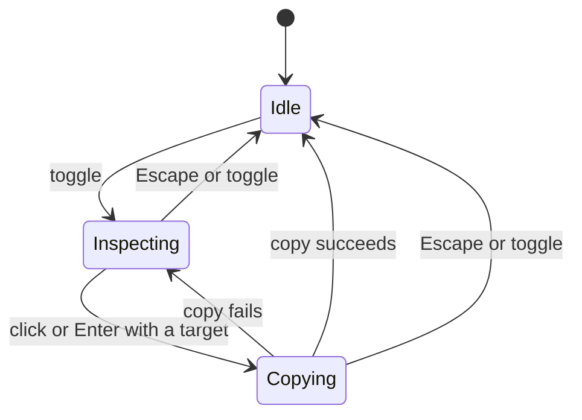

# Steal

A lightweight Chrome extension. Click the toolbar icon, point at any element on
the page, and its page HTML lands on your clipboard, excluding Steal’s own
overlay and temporary class/style changes. The name is a joke;
it only touches your clipboard.

## Use

1. Click the **Steal** toolbar icon, or press **Cmd+Shift+S** (macOS) /
   **Ctrl+Shift+S** (Windows/Linux). An `ON` badge appears and the page shows a
   crosshair cursor.
2. Move the mouse. The element under the cursor is highlighted with a blue box
   and a `tag#id.class` label.
3. Fine-tune without the mouse using the arrow keys:
   - **↑ / ↓** previous / next element (falls back to the parent / the next
     element further up, so a lone child still steps somewhere)
   - **←** parent element
   - **→** first child element

   Traversal skips `head`, `script`, `meta` and friends, so **→** on `<html>`
   lands on `<body>`.
4. **Click** the element, or press **Enter**, to copy its page HTML. A small
   toast confirms, and inspect mode turns off.
5. Press **Esc**, hit the shortcut again, or click the toolbar icon to leave
   inspect mode.

Chrome does not allow a bare `Shift+S` for extension shortcuts (a `Ctrl`, `Alt`,
or `Command` modifier is required), so the default is `Cmd+Shift+S` on macOS and
`Ctrl+Shift+S` elsewhere. Rebind it at `chrome://extensions/shortcuts`.

Moving the mouse always re-selects whatever is under the cursor, discarding any
arrow-key traversal.

## Install (unpacked)

1. Open `chrome://extensions`.
2. Enable **Developer mode** (top right).
3. Click **Load unpacked** and choose this folder.
4. Pin the icon from the puzzle-piece menu.

### After changing the code

- Click the reload icon on the extension card in `chrome://extensions`.
- Reload any page you want to test on (the content script is injected fresh each
  activation and does not hot-update an already-open page).

The extension stays installed across restarts as long as this folder stays put.
If you move it, re-run **Load unpacked** from the new location.

## Development

- No build step. The source files are the shipped files.
- `npm install` installs the development-only DOM test dependency.
- `npm test` runs navigation and inspect-behavior tests with Node’s built-in
  runner. DOM tests use jsdom; the shipped extension has no runtime dependencies.
- `npm run gen-icons` regenerates the placeholder crosshair icons
  (`tools/gen-icons.py`, standard library only).
- `demo.html` is a manual test page with nested lists, links, and buttons.

## Layout

| File | Role |
| --- | --- |
| `manifest.json` | MV3 manifest. `activeTab` + `scripting` only, no host permissions. |
| `background.js` | Service worker. Injects the content script on icon click, keeps the `ON` badge in sync. |
| `lib/dom-nav.js` | Pure helpers: `nextTarget(node, direction)` and `describeElement(el)`. Also `require()`-able in Node. |
| `lib/page-content.js` | Owns injected nodes and temporary page mutations; captures page HTML without Steal’s additions. |
| `content.js` | Inspect-mode controller: overlay, label, keyboard traversal, click suppression, clipboard write, toast. |
| `content.css` | Scoped, defensive styles for the overlay / label / toast. |
| `test/dom-nav.test.js` | Unit tests for the pure helpers. |
| `test/content.test.js` | Input-driven checks for copy lifetime, fallback, and page-content fidelity. |

## Inspect lifecycle

The controller exposes only `toggle()`. Its state and start/stop operations stay
private. These are the three logical states, represented by a session and its
pending-copy flag:

Only one copy can be pending per inspection. Pointer and arrow navigation remain
available while copying, but additional copy requests are ignored. The pending
write uses the HTML captured when it began.

Every completion belongs to the inspection that started it. Exiting invalidates
that ownership, so an old result cannot show feedback, stop a new inspection, or
start a fallback write. A clipboard write already submitted cannot be undone.

Exit removes input listeners and restores temporary page changes immediately.
A successful copy leaves its toast to fade; Escape and toggle-off remove the
current inspection's UI immediately. See the [specification](.specs/00-steal.md)
for page-content ownership and clipboard behavior.

## Not included (v1)

iframes / cross-origin frames, HTML pretty-printing, copying selectors or XPath,
an options page, non-Chromium browsers. See `.specs/00-steal.md`.
