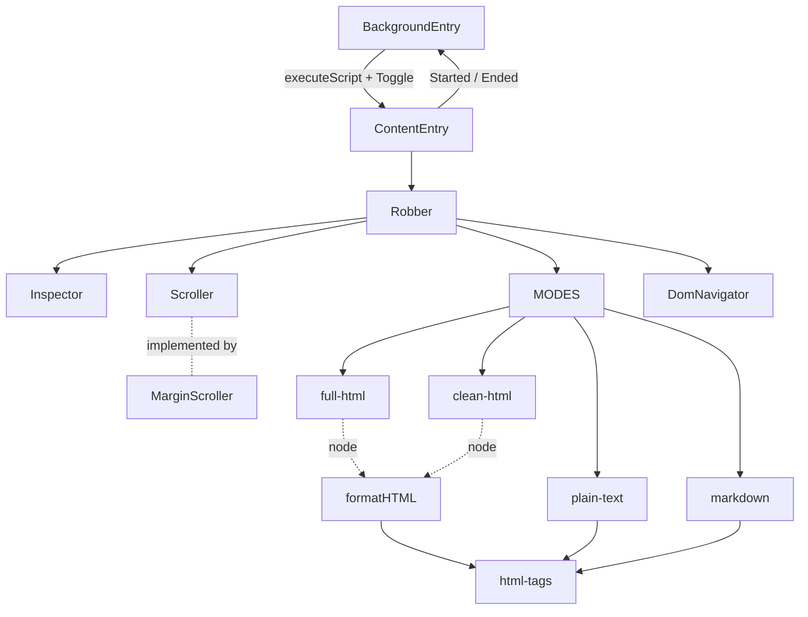
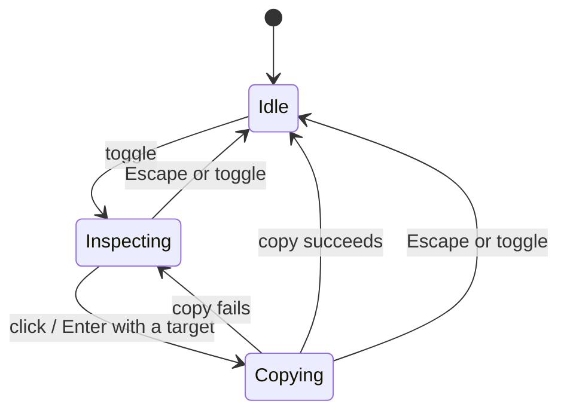

# Steal

Last updated: 2026-09-05

This document describes the final state of Steal: how the extension behaves and
how it is built, as it stands now. It is written to be read on its own, without
tracing the path that got here.

For that history, the numbered design specs under [`../.specs/`](../.specs/) hold
the decisions and rejected alternatives from each stage of the work, and
[`../CHANGELOG.md`](../CHANGELOG.md) is the version-by-version summary.

## Problem Statement

When I am looking at a web page and want one specific element, my options are
both heavier than the task. The DevTools route is open DevTools, use the element
picker, find the node in the Elements panel, right-click, Copy element. And what
it gives back is the exact markup: every Tailwind class, every `data-*` and
`aria-*`, every icon SVG. Most of the time I am pulling a snippet off a page to
remember what it said, not how it was built, and often I want to keep it
structured for my notes (headings as headings, code as code) without the class
soup.

I want a one-key way to point at an element and get it onto my clipboard, and I
want to choose how much of it comes across: all the markup, a cleaned-up
outline, plain text, or Markdown.

## Solution

A local unpacked Chrome extension. Click its toolbar icon (or press a keyboard
shortcut) to turn on "inspect mode" for the current tab. As the mouse moves, the
element under the cursor is highlighted with a translucent overlay and a label
naming it. The selection can also be nudged around the DOM tree with the arrow
keys. Number keys `1`-`4` switch the active copy mode. Clicking the element, or
pressing Enter, copies it in that mode, a toast confirms what was copied, and
inspect mode turns itself off.

The name is a joke. The extension only ever writes to the clipboard; it sends
nothing anywhere.

## User Stories

### Inspect mode lifecycle

1. As a user, I want to toggle inspect mode from the toolbar icon or a keyboard shortcut, so that I do not need to open DevTools or reach for the mouse.
2. As a user, I want the toolbar icon to show an `ON` badge while inspect mode is active, so that I can tell at a glance whether it is running.
3. As a user, I want clicking the toolbar icon again, pressing the shortcut again, or pressing Esc to turn inspect mode off, so that I can cancel without selecting anything.
4. As a user, I want inspect mode to apply only to the tab I activated it on, so that other tabs are unaffected.
5. As a user, I want inspect mode not to survive a page navigation or reload, so that a stale overlay is never left behind.
6. As a user, I want inspect mode to turn itself off after a successful copy, so that the page returns to normal without another step.
7. As a user, I want Esc and toggle-off to remove the overlay immediately, while a success toast is allowed to finish fading, so that cancelling is instant but confirmation is still readable.

### Highlight and label

8. As a user, I want the element under my cursor highlighted with a translucent overlay matching its bounding box, so that I can see exactly what will be copied.
9. As a user, I want a floating label showing the element and a mode-specific preview, so that I can confirm the target and the mode before I click.
10. As a user, I want the overlay and label to never intercept my mouse, so that moving the cursor still reflects the true element underneath.
11. As a user, I want only one element selected at any time, so that the interaction stays simple.
12. As a user, I want the extension's own overlay, label, and toast to never be selectable, copyable, or landed on by the arrow keys, so that I only ever get real page content.
13. As a user, I want the label to sit above the target, or below it when there is no room above, so that it stays on screen.

### Arrow-key navigation

14. As a user, I want Up to move to the previous element sibling, or to the parent when there is none, so that Up always steps somewhere sensible.
15. As a user, I want Down to move to the next element sibling, or, when there is none, to the nearest following element of an ancestor, so that a lone child still steps forward instead of dead-ending.
16. As a user, I want Left to move to the parent element, so that I can widen to a container.
17. As a user, I want Right to move to the first element child, so that I can narrow into a container.
18. As a user, I want traversal to land only on element nodes and to skip document-metadata elements (`head`, `meta`, `title`, `script`, `link`, `style`, `base`, `noscript`) and Steal's own overlay, so that Right on `<html>` lands on `<body>` and I never end up inside `<head>`.
19. As a user, I want arrow presses at the edges of the tree to do nothing (no wrap-around), so that I do not lose my place.
20. As a user, I want an arrow-selected target scrolled into view when it lands offscreen, aligned to whichever edge it passed with a small margin, so that the page keeps its natural scroll direction and the highlight stays visible.
21. As a user, I want the arrow keys and Space not to scroll the page while inspecting, so that navigation and scrolling do not fight.
22. As a user, I want moving the mouse to immediately re-select the element under the cursor and discard any keyboard traversal, so that the mouse is always authoritative.

### Copying

23. As a user, I want to click the highlighted element to copy it, so that the interaction matches how I already point at things.
24. As a user, I want to press Enter to copy the current selection, so that I can finish a keyboard-only traversal without the mouse.
25. As a user, I want my click fully suppressed on the page (no link navigation, no button activation), so that inspecting never triggers the page's own behavior.
26. As a user, I want a small toast at my cursor confirming the copy and naming what was copied, fading on its own after about a second, so that I get feedback without it getting in the way.
27. As a user, I want a failed copy to show an error toast and leave inspect mode running, so that I can retry.
28. As a user, I want each copy to belong to the inspection that started it, so that a slow clipboard write from an inspection I already cancelled cannot show feedback or end a new inspection.
29. As a user, I want the copied element to exclude Steal's own overlay, label, and lingering toast, and to have any temporary class or style change Steal made restored first, so that I get page content only, even when the target is `<body>` or `<html>`.
30. As a user, I want a page element that happens to share Steal's id or class to stay selectable and copyable, so that ownership is by identity, not by name.

### Copy modes

31. As a user, I want to switch the active copy mode with a number key while inspecting, so that I don't have to leave inspect mode and re-select my target.
32. As a user, I want switching mode never to trigger a copy or exit inspect mode, so that I can preview modes on the same target before committing.
33. As a user, I want the mode I last used remembered globally, so that a new inspection starts where I left off regardless of which page I'm on.
34. As a user, I want **Full HTML** (`1`) to give the selected page HTML unchanged in content, pretty-printed with 2-space indentation, with inline elements kept flowing and `<pre>` / `<script>` / `<style>` / `<textarea>` left verbatim.
35. As a user, I want **Clean HTML** (`2`) to keep the tag structure but strip styling and behavior attributes to a small allowlist (`img[src,alt]`, `a[href]`), drop subtrees with no text anywhere in them, and unwrap single-child textless wrappers, so that the result reads like an outline of the real content.
36. As a user, I want **Plain Text** (`3`) to give the words with their block structure but no markup: one block per line, inline elements flowing, `<pre>` verbatim as its own block, `<style>` / `<script>` text dropped, lists numbered or bulleted with nested indent, blocks separated by a single newline.
37. As a user, I want **Markdown** (`4`) to convert only what a tag guarantees (headings, emphasis, code, links, images, lists, blockquotes, rules), drop what only a CSS class would tell me, and return a string that is never routed through the HTML pretty-printer.
38. As a user, I want the hover label to show the right detail per mode: Full HTML shows `tag#id.class` and dimensions; Clean HTML and Markdown show `tag`, dimensions, and a live character count of what would actually be copied; Plain Text shows only the character count.
39. As a user, I want each mode to have a distinct icon in the label, so that I can recognize the active mode without reading.
40. As a user, I want adding a future mode to be one module plus one registry entry, with no change to keyboard handling, label rendering, or any existing mode.

### Markdown conversion detail

41. As a user, I want `<h1>`-`<h4>` as `#`-`####` and `<h5>`/`<h6>` as a bold line, so that the outline survives with ATX depth capped at 4.
42. As a user, I want `<strong>`/`<b>` as `**bold**`, `<em>`/`<i>` as `*italic*`, `<del>`/`<s>` as `~~strikethrough~~`, and `<code>`/`<kbd>`/`<samp>`/`<var>` in backticks.
43. As a user, I want an inline element carrying the exact class token `mdx-code` also treated as inline code, so that HelloInterview's MDX inline-code spans are wrapped in backticks. No other class is read.
44. As a user, I want `<pre>` (and `<pre><code>`) as a fenced block with content verbatim and no language tag, since the language lives in a class or attribute, not a tag.
45. As a user, I want `<a href>` as `[text](href)`, `` as ``, `<ul>`/`<ol>`/`<li>` as Markdown lists with nested indent, `<blockquote>` prefixed `> `, `<hr>` as `---`, and `<br>` as a hard line break.
46. As a user, I want `<table>` flattened to plain text rather than converted to a GFM table, so that the mode never emits broken table markup.
47. As a user, I want a paragraph line that starts with `#`, `>`, `-`, `+`, `*` (each followed by a space) or `1.`-style ordering backslash-escaped, and nothing else escaped, so that body text is not promoted into structure but technical prose full of `_` and mid-sentence `*` is left alone.

### Packaging and development

48. As a user, I want the extension to ask for as few permissions as possible (`activeTab`, `scripting`, `storage`; no host permissions), so that I am comfortable running it.
49. As a user, I want to load it myself as an unpacked extension from a self-contained build folder, with clear reload instructions, so that I can use it without publishing it anywhere.
50. As the maintainer, I want the project in TypeScript `strict` mode with one `npm run build`, a `npm run dev` watch, `npm run typecheck`, and Vitest against the sources, so that DOM-heavy code is checked and there is one toolchain.
51. As the maintainer, I want everything that touches `chrome.*` isolated in `src/entries/`, so that the logic in `src/lib/` never needs a mocked `chrome` global to be tested.
52. As the maintainer, I want the inspection state machine, the DOM-footprint tracking, and the scroll-into-view behavior as separate testable units, so that changing one cannot silently break another.

## Low-Level Design

Structured as the [Hello Interview delivery framework](../../../interview-prep/catalog-tracks/low-level-design/articles/01-delivery-framework.md):
requirements, entities and relationships, class design, implementation,
extensibility.

### Requirements

```text
Requirements:
1. Toggle a per-tab "inspect mode" from the toolbar action or a keyboard command;
   show an ON badge while active; clear it on navigation, Esc, toggle-off, or a
   successful copy. Never restore inspect mode across a navigation.
2. While inspecting: hover selects document.elementFromPoint; arrow keys walk the
   element tree (sibling / parent / child, lone-child gap-jump on Down), skipping
   document-metadata tags and Steal's own nodes, with no wrap-around; the mouse
   moving always overrides keyboard selection.
3. Draw a fixed-position overlay on the target's bounding box and a label that
   names the target and previews the active mode. Neither intercepts pointer
   events. Reposition on selection change, scroll, resize, and the frame after a
   keyboard scroll.
4. Scroll an arrow-selected target into view when it is outside a 96px viewport
   inset or past a horizontal edge, aligned to the edge it passed (tall targets
   top-align), via a temporary patch that leaves no residue on the page.
5. Number keys 1-4 switch the active copy mode. Switching never copies or exits.
   The active mode id persists in chrome.storage.local as one global value and is
   restored when a new inspection starts.
6. Click or Enter copies the target in the active mode: capture a clone with
   Steal's own nodes and temporary changes undone, run the mode's transform,
   turn the result into text, write it with navigator.clipboard.writeText.
   Suppress the page's mousedown/mouseup/click entirely. Show a confirm or error
   toast. On success, exit; on failure, keep inspecting.
7. Each copy belongs to its originating inspection; a completion that arrives
   after that inspection ended does nothing.
8. Capture is page content only: exclude Steal's overlay/label/toast by node
   identity, restore any class/style Steal applied, never mutate the live page.

Out of Scope:
- Iframes and cross-origin frames (top document only).
- Selectors, XPath, computed styles, screenshots, image-producing clipboard writes.
- A toolbar popup or options page; shortcut customization beyond chrome://extensions/shortcuts.
- Firefox, Safari, other non-Chromium browsers.
- Selection history, multi-element selection, persistence across navigation.
- Chrome Web Store publication and packaged distribution.
- GFM table conversion and code-fence language inference in Markdown mode.
```

### Entities and Relationships

```text
Entities:
- BackgroundEntry (src/entries/background.ts) - service worker: toolbar action,
                    keyboard command, script injection, per-tab ON badge
- ContentEntry    (src/entries/content.ts)    - the chrome.storage/runtime
                    boundary; constructs one Robber and guards double-injection
- Robber          (src/lib/robber.ts)         - orchestrator: session, target,
                    UI, active mode, event listeners, copy sequencing
- Inspector       (src/lib/inspector.ts)      - Steal's DOM footprint: injected
                    roots, the temporary inspect-cursor class, clean capture
- Scroller        (src/lib/scroll/scroller.ts, interface) - bring a target into view
- MarginScroller  (src/lib/scroll/margin-scroller.ts) - the implementation in use
- DomNavigator    (src/lib/dom-navigator.ts)  - pure traversal + element descriptions
- Mode / MODES    (src/lib/modes/)            - the copy-mode registry
- formatHTML      (src/lib/utils/format-html.ts) - pure DOM node -> indented HTML
- html-tags       (src/lib/utils/html-tags.ts)   - shared block/inline/void/verbatim tag sets
- MessageType     (src/lib/messages.ts)       - the typed content<->worker protocol

Relationships:
- BackgroundEntry -> chrome.scripting (injects the built content bundle)
- BackgroundEntry -> MessageType (interprets Started / Ended, sends Toggle)
- ContentEntry    -> Robber (constructs and owns one instance)
- ContentEntry    -> MessageType, chrome.storage.local (injected into Robber as callbacks)
- Robber -> Inspector  (has-a; sibling of Scroller)
- Robber -> Scroller   (has-a; sibling of Inspector)
- Robber -> MODES      (reads the active Mode)
- Robber -> DomNavigator (arrow traversal, passing Inspector.isExtensionNode as the skip predicate)
- Robber -> formatHTML (only when a Mode.transform returns a node)
- Mode.transform -> html-tags (Plain Text, Markdown); formatHTML -> html-tags
```

`Inspector` and `Scroller` hold no reference to each other. `Robber` is the only
entity that holds both, so it is the only place that has to know both exist.
Nothing under `src/lib/` imports `chrome`; the two `src/entries/` files are the
only place `chrome.*` appears.



### Class Design

Top-down, orchestrator first.

**`Robber`** - the orchestrator (the name is a pun on "Steal"). Registers the
capture-phase pointer and keyboard listeners, owns which mode is active, and
sequences `Inspector` and `Scroller`. Everything `chrome.*` is injected at the
constructor boundary (`getStoredModeId`, `setStoredModeId`, `notify`), so neither
`Robber` nor its tests need a mocked `chrome`.

| State | Behavior |
|---|---|
| `session: {copying, mode} \| null` | `toggle()` - the one public method |
| `target: Element \| null` | `start()` / `stop(reason)` (private) |
| `ui: {root, overlay, label, labelIcon, labelText} \| null` | `handlePointerMove` / `onKeyDown` / `onClick` / `swallow` (capture-phase) |
| `lastMouse: {x, y}` | `drawOverlay()` / `buildLabelText(mode, rect)` |
| `lengthCache: {target, modeId, length} \| null` | `scrollTargetIntoView()` -> `scroller.scrollIntoView(...)` |
| `nav: DomNavigator`, injected `inspector` / `scroller` / `modes` | `doCopy(x, y)` -> `copyText(text)` |

The three logical states are a nullable `session` plus its `copying` flag, not
separate classes:



- **Idle** - no session, no listeners. A prior success toast may still be fading.
- **Inspecting** - one session owns the target, UI, and listeners.
- **Copying** - that session has one pending write. Further click/Enter is
  ignored (not queued); pointer and arrow navigation still work, but the pending
  write keeps the HTML captured when it began.

Every completion belongs to the session that started it. `stop()` nulls
`session` before any cleanup, so a write that resolves afterward sees
`this.session !== owner` and does nothing. A write already handed to the
clipboard cannot be undone.

**`Inspector`** - the DOM-facing interface for everything Steal adds to or
changes on the page. No knowledge of scrolling.

| State | Behavior |
|---|---|
| `roots: WeakSet<Node>` (mounted UI roots, membership by identity) | `mount(root)` - register and append to `body` or `documentElement` |
| `inspectClass: {el, original, applied} \| null` | `isExtensionNode(el)` - is `el` inside a mounted root? |
| | `setInspecting(on)` - add/remove the `ic-active` class on `<html>` |
| | `capture(el)` - a clone with Steal's nodes removed and the class undone |

```text
capture(el)
  copy = el.cloneNode(true)
  zip([el, ...el.querySelectorAll("*")], [copy, ...copy.querySelectorAll("*")])
    for each (original, clone):
      if roots.has(original): clone.remove()
      if original === inspectClass?.el: restoreInspectClass(clone)
  return copy
```

`restoreInspectClass` restores the `class` attribute verbatim (including whether
it existed) when it still equals what Steal produced; otherwise the page has
edited it, so only Steal's own `ic-active` token is removed. The same rule
governs live cleanup and the captured clone.

**`Scroller`** (interface) - the swap point for "how do we bring a target into
view", fully independent of `Inspector`.

```typescript
interface ScrollAlignment { block: "start" | "end"; inline: "nearest"; margin: number }

interface Scroller {
  scrollIntoView(el: Element, alignment: ScrollAlignment): void;
  flush(): void; // synchronously settle any pending scroll patch right now
}
```

`Robber` calls `scroller.flush()` immediately before `inspector.capture()` and
in `stop()`, so the live page carries no scroll residue by the time anything is
cloned. That is what lets `Inspector` stay unaware `Scroller` exists.

**`MarginScroller`** - the implementation in use: a temporary
`scroll-margin-top` / `scroll-margin-bottom` patch that self-cleans on the next
animation frame.

| State | Behavior |
|---|---|
| `scrollChanges: Map<Element, ScrollMarginChange>` | `scrollIntoView(el, alignment)` - finish any pending entry for `el`, apply the temp margin, call `el.scrollIntoView`, schedule cleanup next frame |
| | `flush()` - finish every still-pending entry now |
| | `finishScroll(el, change)` (private) - revert, unless a newer change replaced it |

The property-diffing math is two pure functions in the same file:
`applyScrollMargin(el, marginPx)` writes both properties and returns a record of
exactly what changed; `restoreScrollMargin(el, change)` restores the `style`
attribute byte-for-byte when it is untouched, else reverts only the properties
Steal still owns (value unchanged, priority not raised to `!important`).

**`DomNavigator`** - side-effect-free traversal.

| Behavior | Result |
|---|---|
| `isSkippable(el)` | true for non-elements and `HEAD`, `META`, `TITLE`, `SCRIPT`, `LINK`, `STYLE`, `BASE`, `NOSCRIPT` |
| `nextTarget(node, "up", skip)` | previous element sibling past `skip`; else the parent (unless skipped) |
| `nextTarget(node, "down", skip)` | next element sibling past `skip`; else the nearest following sibling while walking up the ancestors |
| `nextTarget(node, "left", skip)` | parent element (unless skipped) |
| `nextTarget(node, "right", skip)` | first element child past `skip` |
| `describeElement(el)` | `tag#id.class1.class2`, lowercase tag |

`skip` defaults to `isSkippable`; `Robber` passes
`el => nav.isSkippable(el) || inspector.isExtensionNode(el)`.

**`Mode`** - a duck-typed Strategy object, no base class.

```typescript
interface Mode {
  id: string;         // stable id, also the storage value and icon key
  key: string;        // "1" | "2" | "3" | "4"
  label: string;
  showDescriptor: "full" | "tag" | "none";
  showDimensions: boolean;
  showLength: boolean; // show a live char count of what would be copied
  transform: (el: Element) => Element | string;
}
```

`transform` receives a fresh clone from `Inspector.capture`. A returned node is
turned into text by `formatHTML`; a returned string is used as-is. `MODES` is the
ordered registry `[fullHtml, cleanHtml, plainText, markdown]`; `Robber` and the
label renderer are both driven entirely by it.

**`formatHTML(el)`** - pure DOM node to 2-space-indented HTML string. Block
elements get their own lines; `INLINE_TAGS` flow with surrounding text;
`VOID_TAGS` emit an open tag only; `VERBATIM_TAGS` (`PRE`, `SCRIPT`, `STYLE`,
`TEXTAREA`) pass through via `outerHTML` untouched. Classifies via `html-tags`.

**`MessageType`** - a `const` object, not an enum: `Toggle` (`"inspect:toggle"`,
worker to content), `Started` / `Ended` (content to worker). A derived union
type makes a typo a compile error.

### Implementation

**Activation.** The manifest declares `activeTab`, `scripting`, `storage`, no
host permissions, and no content scripts. The toolbar action and the
`toggle-steal` command (default `Ctrl+Shift+S`, `Cmd+Shift+S` on macOS) both call
`toggleOnTab(tab)`:

```text
toggleOnTab(tab)
  chrome.scripting.insertCSS({ files: ["content.css"] })
  chrome.scripting.executeScript({ files: ["content.js"] })   // one IIFE bundle, all deps inlined
  chrome.tabs.sendMessage(tab.id, { type: Toggle })
  on failure (restricted page): console.warn, do nothing
```

`content.ts` runs once per injection; if `window.__stealRobber` is already set it
bails, so the background's `Toggle` message is the single source of truth.
`background.ts` keeps a `Set` of active tab ids, sets the `#1a73e8` `ON` badge on
`Started`, clears it on `Ended`, on `tabs.onUpdated` `status === "loading"`, and
on `tabs.onRemoved`.

**Toggle to copy.**

```text
ContentEntry receives Toggle -> Robber.toggle() -> start()
  session = { copying: false, mode: MODES[0] }
  ui = buildUI(); inspector.mount(ui.root)
  addEventListener (capture phase): mousemove, mousedown, mouseup, click, keydown, scroll, resize
  inspector.setInspecting(true)                 // ic-active on <html>
  seed target from the last pointer position
  getStoredModeId(id => if session still fresh and still on MODES[0]: switch to stored mode)
  notify(Started)

mousemove          -> lastMouse = (x, y); el = elementFromPoint(x, y)
                      if el and not inspector.isExtensionNode(el): setTarget(el) -> drawOverlay()
mousedown / mouseup -> preventDefault + stopPropagation + stopImmediatePropagation
keydown "2"        -> session.mode = the mode with key "2"; drawOverlay(); setStoredModeId("clean-html")
keydown ArrowUp    -> next = nav.nextTarget(target, "up", skip); if next: target = next; drawOverlay(); scrollTargetIntoView()
keydown Space      -> preventDefault only (stop the page scrolling)
keydown Escape     -> stop("escape")
click / keydown Enter -> doCopy(originX, originY)

doCopy(x, y)
  if no target, no session, or session.copying: return
  owner = session
  desc = nav.describeElement(target)
  scroller.flush()                              // no scroll-margin residue on the clone
  output = owner.mode.transform(inspector.capture(target))
  html = typeof output === "string" ? output : formatHTML(output)
  owner.copying = true
  ok = await navigator.clipboard.writeText(html).then(=> true, => false)
  if session !== owner: return                  // this inspection ended while copying
  owner.copying = false
  if ok:  showToast("Copied " + desc); stop("copied")
  else:   showToast("Copy failed")              // stays inspecting

stop(reason)
  session = null                                // invalidates any in-flight completion
  removeEventListener all; inspector.setInspecting(false); scroller.flush()
  target = null; lengthCache = null
  reason === "copied" ? hide overlay+label, remove root after ~1600ms : remove root now
  notify(Ended)
```

**Label preview.** `buildLabelText` is data-driven off the mode's
`showDescriptor` / `showDimensions` / `showLength`, so nothing branches on which
mode is active. When `showLength` is set it runs the mode's own `transform` on
the captured clone (after `scroller.flush()`) and caches the length by
`(target, modeId)`, since the overlay also redraws on scroll and resize where the
target has not changed.

**Auto-scroll.**

```text
scrollTargetIntoView()
  r = target.getBoundingClientRect(); vh = innerHeight
  above  = r.top    < 96
  below  = r.bottom > vh - 96
  offSide = r.left < 0 or r.right > innerWidth
  if not above and not below and not offSide: return
  tallerThanViewport = r.height + 192 > vh
  toEnd = below and not above and not tallerThanViewport
  scroller.scrollIntoView(target, { block: toEnd ? "end" : "start", inline: "nearest", margin: 96 })
  next frame: if session unchanged, drawOverlay()
```

**The four modes.**

```text
Full HTML   transform = identity -> node -> formatHTML

Clean HTML  transform, in order, returns the mutated node -> formatHTML:
  1. prune: remove any descendant with no text anywhere (STYLE/SCRIPT never count
     as text; an , or an element containing one, always counts)
  2. unwrap: replace any non-root element that has exactly one child element and
     no non-empty direct text node with that child
  3. strip: remove every attribute except a per-tag allowlist (IMG: src, alt; A: href)

Plain Text  transform returns a string (never formatHTML):
  walk in block context; block children on their own line, inline children
  concatenated, text nodes whitespace-collapsed; STYLE/SCRIPT emit nothing;
  PRE emits textContent verbatim, ends trimmed, as its own block; UL/OL via
  renderList (ordered "N. ", unordered "- ", nested +2 spaces); join blocks with
  "\n"; collapse 3+ newlines to 2; trim

Markdown    transform returns a string (never formatHTML):
  block:  h1-h4 -> "#".."####" + text     h5/h6 -> "**" + text + "**"
          pre   -> ``` fence, textContent verbatim, no info string
          ul/ol -> renderList (shared with Plain Text)
          blockquote -> "> " per line     hr -> "---"     table -> flattened text
          style/script -> ""              div/p/other -> transparent (block per html-tags)
  inline: strong/b -> **x**   em/i -> *x*   del/s -> ~~x~~
          code/kbd/samp/var, or class token "mdx-code" (not inside pre) -> `x`
          a[href] -> [x](href)   img ->    br -> hard line break
          span/other -> transparent (inline per html-tags)
  escape: at the start of an emitted paragraph line only, before a space:
          leading "#" ">" "-" "+" "*" -> "\<token>";  leading "<digits>." -> "<digits>\."
          nothing mid-line; "_" is never escaped
  join blocks with "\n\n"; collapse 3+ newlines to 2; trim
```

**Clipboard.** `navigator.clipboard.writeText` is the only write path. A click or
Enter handler in a secure context (the only place the picker is usable) already
satisfies the user-gesture requirement, so there is no `document.execCommand`
fallback. A rejection becomes the "Copy failed" toast.

### Extensibility

- **A fifth mode** is one module exporting a `Mode` object plus one entry in the
  `MODES` array. A mode with its own label glyph also adds one entry to the
  `ICONS` map in `robber.ts`. Keyboard handling, label rendering, persistence,
  and every existing mode are untouched. This is the seam the modes were built
  behind; it has held for four.
- **A different scrolling algorithm** (for example one that scrolls a scrollable
  ancestor rather than patching the target) is a new class implementing
  `Scroller` and a one-line change to which one `content.ts` constructs. The
  `flush()` contract is what keeps `Inspector` out of it.
- **The message protocol** grows by adding a key to `MessageType`; both entry
  files then fail to compile until they handle it.
- **Attribute allowlist** in Clean HTML is a tag-to-attributes lookup; a new
  case (say `time` keeps `datetime`) is one line, no logic change.

## Build and Development

Vite (esbuild) builds `src/entries/content.ts` and `src/entries/background.ts`
in two passes into `dist/`, each a standalone IIFE with every `src/lib/`
dependency inlined (a content script injected by `executeScript({ files })`
cannot load ES modules). The background pass also copies `manifest.json`,
`icons/`, and `content.css` into `dist/`, so `dist/` is the entire self-contained
"Load unpacked" folder. `dist/` is gitignored.

```text
src/
├── entries/
│   ├── content.ts        # chrome.storage / chrome.runtime boundary; builds one Robber
│   └── background.ts     # chrome.action / scripting / tabs / commands; the ON badge
└── lib/
    ├── robber.ts         # orchestrator + the ICONS map
    ├── inspector.ts
    ├── dom-navigator.ts
    ├── messages.ts
    ├── scroll/
    │   ├── scroller.ts        # interface
    │   └── margin-scroller.ts # implementation + pure scroll-margin math
    ├── utils/
    │   ├── format-html.ts
    │   └── html-tags.ts
    └── modes/
        ├── modes.ts      # the Mode interface + MODES registry
        ├── full-html.ts
        ├── clean-html.ts
        ├── plain-text.ts # also exports renderList
        └── markdown.ts
```

| Command | What it does |
|---|---|
| `npm run build` | clean `dist/`, then the content and background Vite passes |
| `npm run dev` | the same two passes in `--watch` mode |
| `npm run typecheck` | `tsc --noEmit`, `strict` |
| `npm test` | `vitest run` (jsdom) |
| `npm run gen-icons` | regenerate the placeholder icons (`tools/gen-icons.py`, standard library only) |

Install: `chrome://extensions` -> Developer mode -> Load unpacked -> pick
`dist/`. After changing code, rebuild (or run the watch), click reload on the
extension card, and reload the target page (the content script is injected fresh
per activation and does not hot-update an already-open page).

## Testing Decisions

Tests assert observable behavior through the seams the extension already uses,
never private helpers or traversal order. This project has no issue tracker, so
"a good test" is judged against the existing files, not an external rubric.

| Seam | Test file | What it covers |
|---|---|---|
| `nav.nextTarget` / `describeElement`, on fake element trees | `test/dom-navigator.test.ts` | traversal in each direction, skipped tags, edges, descriptions |
| `formatHTML(node)` on a parsed fragment | `test/format-html.test.ts` | inline vs block indentation, `pre`/`script`/`style`/`textarea` passthrough |
| `mode.transform(element)` - a pure element-to-string(or-node) function | `test/modes.test.ts` | every conversion rule per mode, the registry order and keys `1`-`4` |
| `Inspector` methods, no `chrome` and no scroll mock needed | `test/inspector.test.ts` | extension-node identity, clean capture, class restore including page-edited classes |
| `Robber`, with `chrome.*` mocked at its constructor callbacks and `inspector` / `scroller` mocked at their interfaces | `test/robber.test.ts` | the state machine, digit-key mode switching, stale-completion guard, `flush()` before capture and on `stop()` |
| `MarginScroller` plus the pure `applyScrollMargin` / `restoreScrollMargin` | `test/scroll/margin-scroller.test.ts` | the `Map` / `requestAnimationFrame` / `flush()` timing, byte-exact vs per-property revert |

`html-tags` and `MessageType` have no behavior of their own; `formatHTML`'s
tests guard that sharing the tag sets changed nothing.

Not covered here, and only verifiable in a real unpacked Chrome load: real
clipboard permission and the user-gesture requirement, click suppression on a
live page, the `chrome.commands` shortcut, the `ON` badge, and visual overlay
placement. `demo.html` is the manual test page.

## Out of Scope

- Iframes and cross-origin frames; inspection uses the top document only.
- Selectors, XPath, computed styles, screenshots, and any image-producing
  clipboard path.
- SVG-aware cleaning; Clean HTML always drops SVG content as textless.
- GFM table conversion and code-fence language inference in Markdown mode.
- Any CSS-class-driven conversion beyond the single `mdx-code` inline-code rule.
- Full Markdown escaping (mid-line `*`, `_`, backticks, `[` `]` `|`, entities).
- A toolbar popup or options page; shortcut rebinding beyond
  `chrome://extensions/shortcuts`.
- Settings, selection history, multi-element selection, persistence across
  navigation.
- HMR / auto-reload dev tooling.
- Firefox, Safari, other non-Chromium browsers.
- Chrome Web Store publication and packaged distribution.

## Further Notes

- The design arc that produced this structure (the `format` to `mode` rename,
  the `Robber` / `Inspector` / `Scroller` split, the h4 ATX cap, `mdx-code` as
  the one class-based rule) is recorded in the numbered specs under `../.specs/`
  and the `../.handoff/` documents. `../CHANGELOG.md` is the version-level
  summary.
- Naming in this codebase is literal and descriptive over short or clever, with
  one sanctioned exception: `Robber`, a pun on "Steal".
- No em dashes anywhere, including code comments and commit messages.
